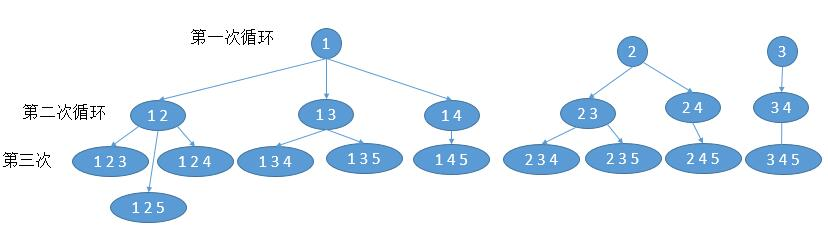

学习笔记

## 递归模板

~~~java
public void recur(int level, param){
    // terminator 递归终止条件
    if (level > MAX_LEVEL) {
	// process result and return 处理结果
        return;
    }
	
    // process current logic 处理当前层程序
    process(level, param);
	
    // drill down 下探一层
    recur(level+1, newParam);
	
    // revert the current status 重置当前层状态，一般不用
}
~~~

## 分支模板

~~~java

public void divideConquer(problem, param1, param2 .....) {
    // terminator 递归终止条件
    if (problem == null) {
        // process result and return 处理结果，比如添加到list等等
        return;
    }
	
    // process data 处理数据，分割子问题。比如pow里面将数据除以2
    data = prepareData(problem);
    subproblems = splitProblem(problem, data);
	
    // conquer subproblems 处理子问题
    subresult1 = divideConquer(subproblems[0], p1, p2 ...);
    subresult2 = divideConquer(subproblems[1], p1, p2....);
    subresult3 = divideConquer(subproblema[3], p1, p2 ...);

    // process and gererate final result 合并结果，比如pow将结果相乘
    result  = mergeResult(subresult1, subresult2, subresult3);
	
    // revert the current level status 重置当前层状态
}

~~~

## 练习总结

### 1.二叉树的序列化与反序列化

序列化使用**先序遍历**转换成字符串，反序列化同样使用**先序遍历**来完成，注意递归思想是 左节点==左子树，右节点==右子树

### 2.二叉树的最近公共祖先

这个函数的功能有三个：给定两个节点 **p** 和 **q**

如果 **p** 和 **q** 都存在，则返回它们的公共祖先；
如果只存在一个，则返回存在的一个；
如果 **p** 和 **q** 都不存在，则返回NULL

如果左子树为空，必定都在右子树，如果右子树为空，必定在左节点
两者皆不为空，root必定是最小公共节点

### 3.从前序与中序遍历序列构造二叉树

这题思维从**后序与中序遍历序列构造二叉树**中启发

前序遍历： 根-左-右， 中序遍历： 左-根-右

得出 根的位置，然后左子树区间，右子树区间进行遍历

root.left = helper(is, ri - 1, ps + 1, ps + ri - is);
root.right = helper(ri + 1, ie, ps + ri - is + 1, pe);

### 4.排序 && 组合

排序跟组合情况是有不同的，譬如：（1，2){组合}->[1, 2] [2, 1]{排序} 

组合的其实跟分治和回溯的思想类似的，单独先把每个元素拆成1个和剩余的元素组合算是一层，如此类推到数组最大就进行回退。

排序跟组合类似，但是**每个元素**都会遍历所有元素，但是会把**已经找好位置**的元素记录到visited上避免重复，回退的时候visited标志去掉

