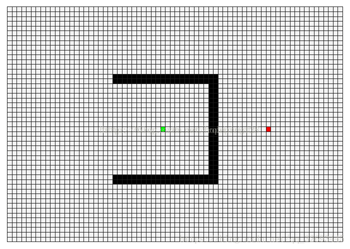
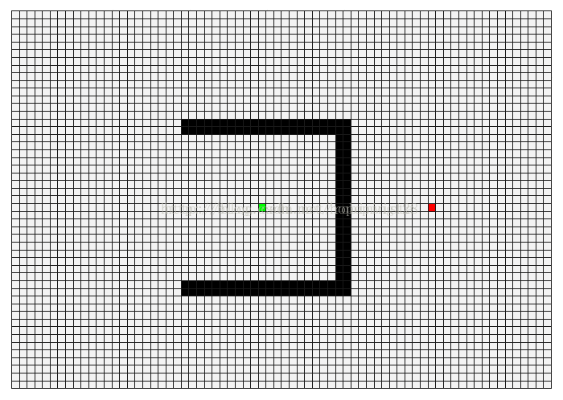
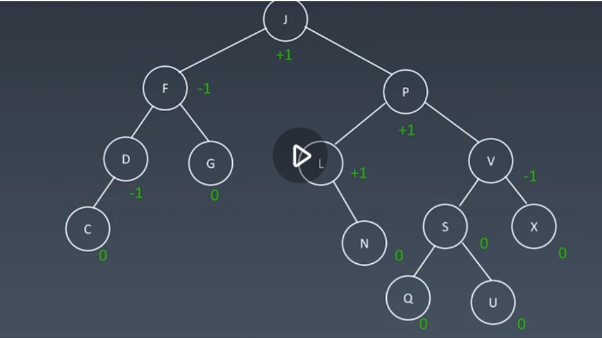
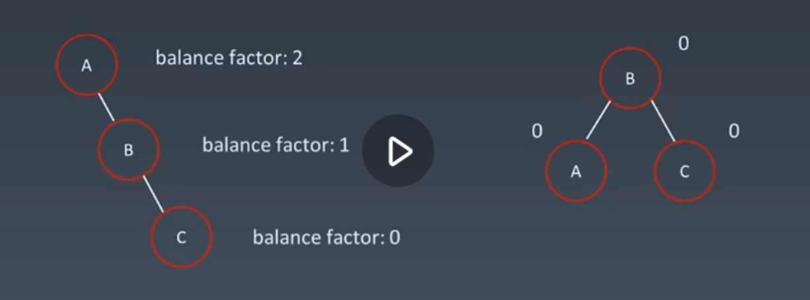
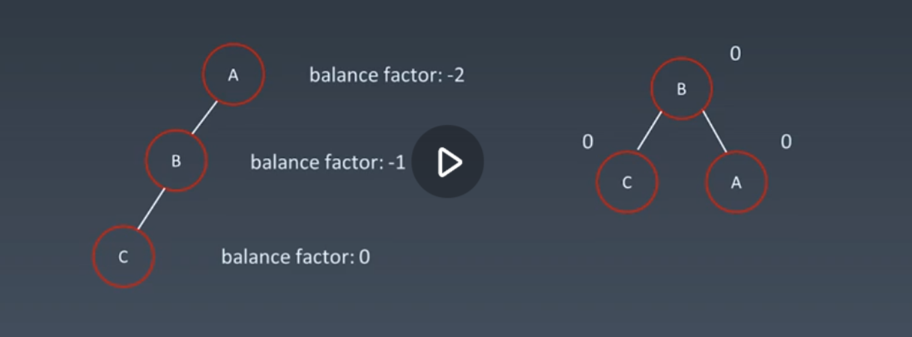
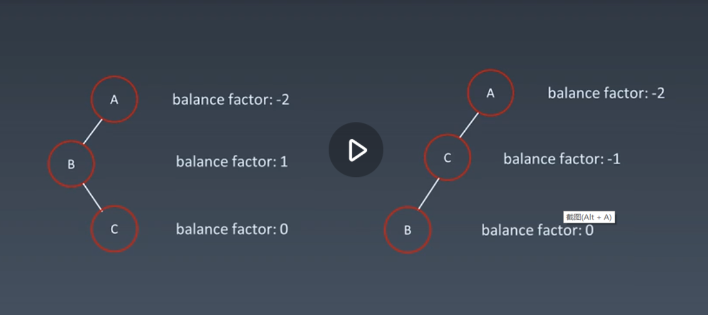
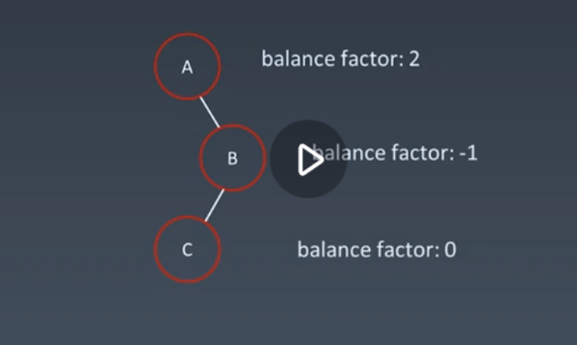
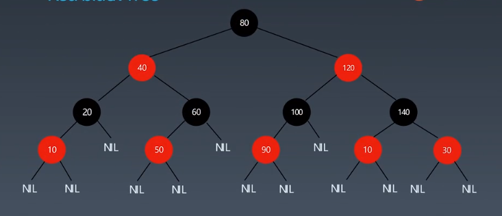

学习笔记

## 字典树 Tire树

1.节点本身不存在完整单词；
2.从根节点到某一节点，路径上经过的字符连接起来，为该节点对应的字符串；
3.每个节点的所有子节点路径代表的字符都不相同。

数据结构有26个引用（26个字母）单词的下一位有引用是该字母的话不为空，还有一个isWord的单词标记判断从根节点到这个子节点的路径是否为一个完整的单词

Tire树时间复杂度只跟字符串长度有关，所以时间复杂度为O(m)，分析单词搜索II中整个board二维数组元素都是一个个字母，因此时间复杂度最多算O(m* n)

## 并查集 UnionFind

使用场景
集合运算，group操作

基本操作
makeSet(s) 建立新并查集，其中包含s个元素
unionSet(x,y) 把元素x和元素y所在集合合并，要求x和y所在集合不相交，若相交则不合并
find(x) 找到元素x所在集合代表。也用于判断两个元素是否位于同一个集合，只要将各自代表比较一下就行了

find -》》》 使用数组parent[n] 是 **n** 的父节点，在find 中有两步操作，1.不停判断p的父节点是否是自己，如果不是parent[n] 赋值成 他的父节点，然后p = parent[p]; (以此减少之后的遍历)，如果是p的父节点是自己，那就是root 则返回

union ->>>> 找出两个集合的root节点是否一样，一样则直接返回，不一样则把其中一个的root的父节点由原来的自己改成另外一个集合的root。

## DFS 剪枝

剪枝策略就是在搜索过程中利用过滤条件来剪去完全不用考虑（已经判断这条路走下去也得不到最优解）的搜索路径，从而避免一些不必要的搜索，大大优化算法求解速度，还保证了结果的正确性

应用到回溯算法中，我们就可提前判断当前路径是否能产生结果集，如果否，就可提前回溯。而这也叫做可行性剪枝

另外还有一种叫最优性剪枝，每次记录当前得到的最优值，如果当前结点已经无法产生比当前最优解更优的解时，可以提前回溯

用isVilid来判断是否递归下去，累积结果型的递归需要进行回溯

## 双向 BFS

~~~python
    def BFS(graph, start, end) :

        end_queue = []
        begin_queue = []
        visited = []

        # 分别用左边和右边扩散的哈希表代替单向 BFS 里的队列
        begin_queue.append(start)
        end_queue.append(end)
        end_queue.append(start)

        visited.add(start)
        visited.add(end)

        while (!begin_queue.isEmpty && !end_queue.isEmpty) :

            # 优先选择小的哈希表进行扩散，考虑到的情况更少
            if (begin_queue.size() > end_queue.size()) 
                tmp = begin_queue
                begin_queue = begin_queue
                end_queue = tmp

            #next_level 在扩散完成以后，会成为新的 begin_queue
            next_level = []
            for begin_queue
                node = queue.pop()

                if (end_queue.contains(node)) {
                    return ;
                }

                nodes = generate_related_nodes(node)
                next_level.push(nodes)
                visited.push(nodes)

            begin_queue =   next_level;
~~~

## A*算法

A*算法和dijkstra算法都是启发式搜索，dijkstra算法可以看成是**广度优先搜索**，而A*可以认为是**深度优先搜索**。
dijkstra就是保证当前节点的值对于前面的层一定是最优的（不管后面有啥只往前看），所以最后到终点的时候，可以保证终点到前一层选一个最优的点，这样从终点到起点一直选当前最小得到的路径一定是最优的。
A*可以轻松地用在比如无人机航路规划中，而dijkstra建立在较为抽象的图论层面。
A*算法主要是有两张表， 一个open表，一个是close表。
1. 将起点加入open表。
2. a)遍历open list，找F（F = G + H）值最小的节点，把他作为当前要操作的节点；
2. b)把这个节点移到close list；
2. c)把当前操作节点周围的8个节点放到open list中（除了不可达的节点，比如墙、禁飞区等）；
2. d)重复上述操作，每次都去F值最小的节点作为当前操作节点。
3. 当终点加入到close表中的时候停止。
4. 保存路径，从终点开始，每个节点沿着父节点移动到起点，就是最终路径。
上面F = G + H中：H是启发函数，是当前点到终点距离的估计，一般采用曼哈顿距离（当前点和终点横纵坐标差之和）；G就是起点到当前点的距离，这里G值的度量方式一般是上下左右取一个值比如10，对角线的四个点取一个值比如14（一般比上下左右的值要大），而在A*中表示障碍点一般会给对应点一个特别大的G值，所以在筛选的时候就会放掉

深度优先

广度优先

## AVL树和红黑树的实现和特性

 1. 二叉搜索树 Binary Search Tree

 二叉搜索树，也称二叉排序树、有序二叉树（Orderd Binary Tree）、排序二叉树（Sort Binary Tree）、是指一颗空树或者具有下列性质的二叉树：

 <1>. 左子树上**所有节点**的值均小于它的根节点
 <2>. 右子树上**所有节点**的值均大于它的根节点
 <3>. 以此类类推：左、右子树也分别为二叉树。

 它的中序遍历之后的结果是升序排列的。

 保证性能的关键
1.保证二维维度！ -》 左右子树节点平衡 （recursively）

2.Balance Factor (平衡因子) ：
是它的左子树的高度减去它的右子树的高度（有时相反）
Balance factor = {-1, 0, 1}

3.通过旋转操作来进行平衡（四种）

<1> 右右子树->左旋 

<2> 左左子树->右旋

<3> 左右子树->左右旋

<4> 右左子树->右左旋.png

总结： 以叶子做轴看下还是上来判断旋向

 2. 红黑树

 红黑树是一种近似的二叉搜索树，它能够确保任何一个节点的左右子树的**高度差小于两倍**。具体来说，红黑树是满足如下条件的二叉搜索树：

  - 每个节点要么是红色，要么是
  - 红黑树的添加操作性能更好 （一般两者要求的对半的情况下使用红黑树）
  - AVL存的额外信息fator更多，需要更多内存

