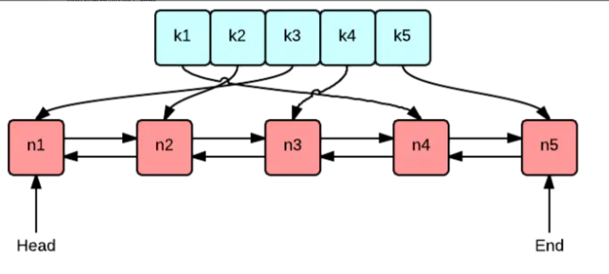

学习笔记

## 位运算基础

含义|运算符|示例
--|--|--
左移|<<|0011 => 0110
右移|>>|0110 => 0011
取反|~| ~1 = 0

含义|运算符|示例
--|--|--
按位或|<<|0011 \| 1011 = 1011
按位与|&|0011 & 1011 = 0011
按位取反|~|0011 => 1100
按位异或|^|0011 ^ 1011 = 1000

异或操作：

~~~java

x ^ 0 = x;
x ^ 1s = ~x; //注意 1s = ~0
x ^ (~x) = 1s
x ^ x = 0
c = a ^ b => a ^ c = b, b ^ c = a // 交换两个数
a ^ b ^ c = a ^ (b ^ c) = (a ^ b) ^ c
~~~

### 1 指定位置的位运算

~~~java
将x最右边的n位清零        x & (~0 << n)
获取x的第n位的值(0或者1)  (x >> n) & 1
获取x第n位的幂值          x & (1 << n)
仅将第n位置为1           x | (1 << n)
仅将第n位置位0           x & (~(1<< n))
将x最高位至n位（含）清零  x & ((1 << n) - 1)

判断奇偶性
x % 2 == 1 ---  (x & 1) == 1
x % 2 == 0 ---  (x & 1) == 0

x >> 1 ---- x / 2 
即： x = x / 2; --- x = x >> 1;
    mid = (left + right) / 2 --- mid = (left + right ) >> 1;

x = x & (x - 1) 清零最低位的1
x & -x 得到最低位的 1

x & ~x = 0
~~~

x & (x - 1)示意图

[位1的个数](pic/位1的个数.png)

2的幂是指 二进制位中除了第0位，有且仅有1个1的情况

## LRU分析

简单的说，就是保证基本的get和set的功能的同时，还要**保证最近访问(get或put)的节点保持在限定容量的Cache**中，如果超过容量则应该把LRU(近期最少使用)的节点删除掉。

那么我们思考一个问题：如何设计实现一个LRU Cache？
那么，我们可能需要使用类似这样的数据结构去实现这个LRU Cache：

对一个Cache的操作无非三种：插入(insert)、替换(replace)、查找（lookup）

为了能够快速删除最久没有访问的数据项和插入最新的数据项，我们使用 双向链表 连接Cache中的数据项，并且保证链表维持数据项从最近访问到最旧访问的顺序。

**插入(insert)**
当Cache未满时，新的数据项只需插到双链表头部即可。时间复杂度为.

**替换(replace) = insert + delete**
当Cache已满时，将新的数据项插到双链表头部，并删除双链表的尾结点即可。时间复杂度为.

**查找（lookup）**
每次数据项被查询到时，都将此数据项移动到链表头部。

经过分析，我们知道使用双向链表可以保证插入和替换的时间复杂度是，但查询的时间复杂度是，因为需要对双链表进行遍历。为了让查找效率也达到，很自然的会想到使用 **hash table** 。

~~~java
public class LRUCache {

    class DLinkedNode {
        int key;
        int value;
        DLinkedNode prev;
        DLinkedNode next;
        public DLinkedNode() {}
        public DLinkedNode(int key, int value) {
            this.key = key;
            this.value = value;
        }
    }

    private Map<Integer, DLinkedNode> cache = new HashMap<>();
    private int size;
    private int capacity;
    private DLinkedNode head, tail;

    public LRUCache(int capacity) {
        this.size = 0;
        this.capacity = capacity;
        //使用伪头部和伪尾
        head = new DLinkedNode();
        tail = new DLinkedNode();
        head.next = tail;
        tail.prev = head;
    }

    public int get(int key) {
        DLinkedNode node = cache.get(key);
        if (node == null) {
            return -1;
        }
        // 如果 key 存在，先通过哈希表定位，再移动到头部
        moveToHead(node);
        return node.value;
    }

    public void put(int key, int value) {
        DLinkedNode node = cache.get(key);
        if (node == null) {
            //如果key不存在，创建一个新的节点
            DLinkedNode newNode = new DLinkedNode(key, value);
            cache.put(key, newNode);
            addToHead(newNode);
            ++size;
            if (size > capacity) {
                //如果超出容量，删除双向链表的尾部节点
                DLinkedNode tail = removeTail();
                // 删除哈希表中的对应项
                cache.remove(tail.key);
                --size;
            }
        }
        else {
            node.value = value;
            moveToHead(node);
        }
    }

    private void addToHead(DLinkedNode node) {
        node.prev = head;
        node.next = head.next;
        head.next.prev = node;
        head.next = node;
    }

    private void removeNode(DLinkedNode node) {
        node.next.prev = node.prev;
        node.prev.next = node.next;
    }
    private DLinkedNode removeTail() {
        DLinkedNode res = tail.prev;
        removeNode(res);
        return res;
    }

    private void moveToHead(DLinkedNode node) {
        removeNode(node);
        addToHead(node);
    }

}
~~~

## 排序

各种排序时间复杂度：

比较类排序：
通过比较来决定元素间相对次序，由于其时间复杂度不能突破O(nlogn),因此也称为非线性时间比较类排序
（类似系统函数中的comparator）

非比较类排序:
不通过比较来决定元素间的相对次序，它可以突破基于比较排序的时间下界，以线性时间运行，因此也称为线性时间非比较类排序

### 1 o(n^2) --- 初级排序

选择排序 (Selection Sort)
每次找最小值，然后放到待排序数组的起始位置。

插入排序 (Insertion Sort)
从前到后逐步构建有序序列；对未排序数据，在已排序序列中从后向前扫描，找到相对应位置并插入。

冒泡排序 (Bubble Sort)
嵌套循环，每次查看相邻的元素如果逆序，则交换。

#### 1.1 选择排序代码

~~~java
    //平均时间：O(n^2)
    public static int[] select(int[] array) {
        for (int i = 0; i < array.length; i++) {

            int minIdx = i;

            for(int j = i + 1; j < array.length; j++) {
                if(array[j] < array[minIdx]) {
                    minIdx = j;
                }
            }

            int tmp = array[minIdx];
            array[minIdx] = array[i];
            array[i] = tmp;
        }
        return array;
    }
~~~

### 1.2 冒泡排序

~~~java
    //平均时间 ：O(n^2)
    public static int[] bubble(int[] array) {
        if (array == null) {
            return null;
        }

        for (int i = 0; i < array.length; i++) {
            for (int j = 0; j < array.length - i - 1; j++) {
                if(array[j] > array[j + 1]) { //由小到大 是大于， 由大到小 是小于
                    int tmp = array[j];
                    array[j] = array[j + 1];
                    array[j + 1] = tmp;
                }
            }
        }

        return array;
    }
~~~

### 2 O(logn) 

快速排序 （Quick Sort）

数组取标杆pivot, 将小元素放pivot左边，大元素放右侧，然后依次对右边和右边的子数组继续快排；以达到整个序列有序。

归并排序(Merge Sort)

把长度为n的输入序列分成两个长度为n/2的子序列；
对这两个子序列分别采用归并排序；
将两个排序好的子序列合并成一个最终序列；

归并和快排具有相似性，但步骤顺序相反

归并：先排序左右子数组，然后合并两个有序子数组
快排：先调出左右子数组，然年对于左右子数组进行排序

堆排序（Head Sort）-插入O(logN), 取最大/小值O(1)

1.数组元素依次建立小顶堆
2.依次取堆顶元素，并删除

### 2.1 快速排序代码

~~~java
    /*
    *
    *  快速排序
    *数组取标杆pivot, 将小元素放pivot左边，
    * 大元素放右侧，然后依次对右边和右边的子数组继续快排；以达到整个序列有序。
    * */

    public static void quickSort(int[] array, int begin, int end) {

        if (end <= begin) {
            return;
        }

        int pivot = partition(array, begin, end);
        quickSort(array, begin, pivot -1);
        quickSort(array, pivot + 1, end);
    }

    private static int partition(int[] array, int begin, int end) {
        // pivot: 标杆位置，counter: 小于pivot的元素的个数
        int pivot = end, counter = begin;
        for (int i = begin; i < end; i++) {
            if (array[i] < array[pivot]) {
                int temp = array[counter];
                array[counter] = array[i];
                array[i] = temp;
                counter++;
            }
        }

        int temp = array[pivot];
        array[pivot] = array[counter];
        array[counter] = temp;

        return  counter;
    }
~~~

### 2.2 归并排序代码

~~~java
    /*
    *
    *  快速排序
    *数组取标杆pivot, 将小元素放pivot左边，
    * 大元素放右侧，然后依次对右边和右边的子数组继续快排；以达到整个序列有序。
    * */

    public static void quickSort(int[] array, int begin, int end) {

        if (end <= begin) {
            return;
        }

        int pivot = partition(array, begin, end);
        quickSort(array, begin, pivot -1);
        quickSort(array, pivot + 1, end);
    }

    private static int partition(int[] array, int begin, int end) {
        // pivot: 标杆位置，counter: 小于pivot的元素的个数
        int pivot = end, counter = begin;
        for (int i = begin; i < end; i++) {
            if (array[i] < array[pivot]) {
                int temp = array[counter];
                array[counter] = array[i];
                array[i] = temp;
                counter++;
            }
        }

        int temp = array[pivot];
        array[pivot] = array[counter];
        array[counter] = temp;

        return  counter;
    }
~~~

### 2.3 堆排序代码

~~~java
    /*
    *   1.数组元素依次建立小顶堆
        2.依次取堆顶元素，并删除
    *
    * */
    public void heapSort(int[] array) {
        if (array.length == 0) {
            return;
        }

        
        BinaryHeap binaryHeap = new BinaryHeap(array.length);

        for (int i : array) {
            binaryHeap.insert(i);
        }
        
        //因为BinaryHeap是大顶堆，所以从后面开始赋值
        for (int i = array.length - 1; i >= 0; i--) {
            array[i] = binaryHeap.delete(0);
        }
    }
~~~

### 3 o(n) --特殊排序

计数排序(Counting Sort)
计数排序要求输入的空间必须是有确定范围的整数。将输入的数据值转化为键存储在额外开辟的数组空间中；然后依次把计数大于1的值填充回原数组。

桶排序(Bucket Sort)
桶排序的工作原理；假设输入的数据服从均匀分步，将数据分到有限数量桶里，每个桶再分别排序（有可能再使用别的排序算法或是以递归的方式继续使用桶排序进行排序）。

基数排序(Radix Sort)
基数排序是按照低位先排序，然后收集；再按照高位排序，然后再收集；依次类推，直到最高位。有时候有些属性是优先级顺序的，先按低优先级排序，再按高优先级排序。

